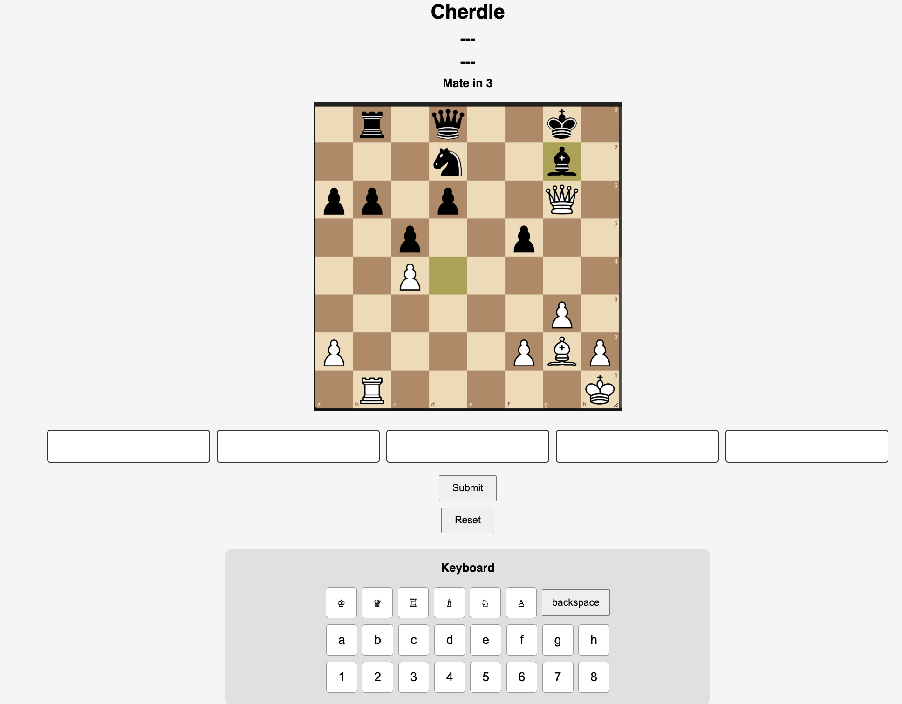

# Cherdle
https://liammcph.github.io/chess_puzzle_game_Cherdle/

A chess puzzle game in Wordle format where your move inputs are highlighted in orange/green to indicate correctness.

## Description

Cherdle combines the strategic depth of chess puzzles with the feedback-driven gameplay of Wordle. Unlike traditional chess puzzles where you submit one move at a time, Cherdle challenges you to think through the entire sequence of a puzzle before receiving feedback.

I picked this project because I like chess and used to play Wordle, and thought it could be a fun way to combine the two games. It pushes you to think through whole sequences rather than individual moves.

## Getting Started

## Technologies Used

- JavaScript
- HTML
- CSS

## Attributions

- [Lichess](https://lichess.org) - Chess puzzles
- [Chess.com](https://www.chess.com/home) - How to play chess
- [MDN Web Docs](https://developer.mozilla.org/en-US/) - Web development documentation

## Next Steps

Planned future enhancements:
- annimation of correct moves at you win/game over
- system for pulling new puzzles 
- currently everything hard coded to 5 move puzzles, add flexible length 
- system for harder/easier puzzles based on completion 